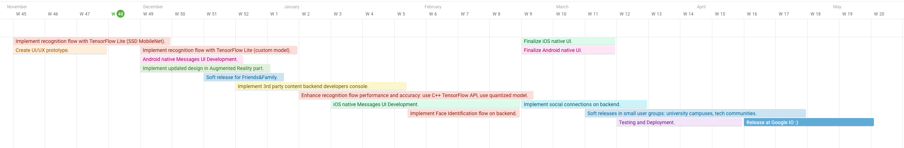

# XSight

### Augmented Reality social app to merge digital and physical worlds

**Idea and how we use Machine Learning**  
 
 

XSight Demo:

[Interactive Prototype](https://xd.adobe.com/view/322f961d-8e20-471c-673d-2d0631fa16bf-441e/)

http://xsight.online

**XSight is an Augmented Reality social mobile application that gets digital information instantly overlay-ed over the dynamic real world objects in real-time. Point your camera to a person or taxi, tap on it and message it instantly.**

**Or, simply put, Pokemon-Go like social app.**  

Imagine getting answers to "who is this?" or "what is that?" or even "which white sedan is my Uber taxi?" using your phone camera! I want to live in such a future. And so do 100+ potential users according to user interviews, which is about 90% of people we talked to.

**It is almost impossible right now to interact online based on what you see in the real world.**

We can bring information into Augmented Reality Camera Android application and map it precisely to the real world objects in realtime.

Look at something interesting through your device camera, and get information instantly overlay-ed over the dynamic real world objects in real-time!
 
**For example, you can point your phone camera to the person on the street and see his social profile on top of his head as a hologram. Click this hologram and send a message instantly!**

To achieve this, we use ARCore, device sensors, ML and CV.
Specifically, we use Google-supported on-device machine learning offering - **TensorFlow Lite**. We run object detection and pose estimation for every camera frame to map information to people and vehicles.
We use transfer learning with SSD MobileNet to optimize object detection to our needs. We train the model on the backend and we run inference on-device using TensorFlow Lite.

We also use Machine Learning and TensorFlow for facial recognition, but this runs on backend only. We use Batch Architecture to train facial recognition models clustered by location based on user submitted data.

 
 

**Where the project is now.**

 

We've built the prototype (check video above) and we are going to have our first release to friends and family next month.
Currently we have:
1. Unity Augmented Reality module (Crossplatform) ~100 commits in C# 80% done.
2. Android native app module. ~200 commits in Java and Kotlin. 95% done.
3. iOS native app module in Swift. 50% done.
4. Landing page: http://xsight.online
5. [New app design](https://xd.adobe.com/view/322f961d-8e20-471c-673d-2d0631fa16bf-441e/)
6. Backend using Firebase and Cloud Functions. 50% done.

 

**Plan and Timeline how to bring XSight to life.**

 

* **November 2019:**
 * Implement recognition flow with TensorFlow Lite (SSD MobileNet).
 * Create UI/UX prototype.

* **December 2019:**
 * Implement recognition flow with TensorFlow Lite (transfer learning from SSD MobileNet).
 * Android native Messages UI Development.
 * Soft releases for Friends&Family.
 * Implement updated design in Augmented Reality part.

* **January 2020:**
 * Implement 3rd party content backend developers console.

* **February 2020 :**
 * iOS native Messages UI Development.
 * Enhance recognition flow performance and accuracy: use C++ TensorFlow API, use quantized model.
 * Implement Face Identification flow on backend.

* **March 2020 :**
 * Finalize iOS native UI.
 * Finalize Android native UI.
 * Implement social connections on backend.

* **April 2020 :**
 * Testing and Deployment.
 * Soft releases in small user groups: university campuses, tech communities.
* **May 2020 :**
 * Release at Google IO :)
 

 

**How can Google help us.**
1. **Help us to squeeze every bit of performance for object detection on-device inference**   
2. **Help us reach a wide audience**  
3. **Access to https://cloud.google.com/tpu/ to train models** (currently we do this locally and it takes forever)
4. **Access to https://cloud.google.com/automl/ to train models**  (currently we do this locally and it takes forever)
5. Help us build ML pipeline for model training for person recognition based on location clusters. We plan to use Batch ML Pipeline Architecture, but we could really use some help with this.

 

**About our team.**  

My name is Sergii Kozyrev. I'm the founder and CEO of XSight. I'm a passionate software engineer, husband and conference speaker. I have conducted 100+ Software Engineering interviews. Love hackathons, won 5 of them! Worked on 2 Android apps with total audience about 100 million users. Have MS degree in IT Security.

We have a team of 9 engineers and designers.
The team has 70+ years of experience in software development, 10+ years of experience in machine learning and 20+ years in product design combined.

Alex Zaitsev - Co-founder & Business Developer. Has strong software development background, 3+ years in mobile advertising. Knows how to get and engage people.  Experienced in quick product launching and testing. Founder of Malvo Games.

Iurii Pleskach - iOS Development Lead. Written tone of code using Objective-C, C++, Swift, Java, C#. Released a lot of applications and led several very successful mobile teams. One of the most successful apps he worked on had more than 2 million users.

David Mayboroda - Machine Learning Architect. Machine Learning Solution Architect and a speaker at various tech conferences. Loves to solve problems.

Mykola Podolian - Android Developer. Has 9+ years of experience as an Android Engineer, wrote his first program at age 8.

Oleksandr Kyrylin - Unity Developer. Has MS degree in Applied Math. He is a guy who deals with tasks of any kind of difficulty.

Ilya Bykov - iOS Developer. Has 9+ years of experience. In love with things that simplify people's life.

Dima Samsonov - Product Designer. Has 10+ years of experience in UI/UX for web and mobile. Worked with companies from enterprise to pre-seed level startups.

Konstantin Chkhaidze - Backend Engineer. Has 14 years of experience as a Software Engineer. Knows everything about python, micro services and DevOps.
